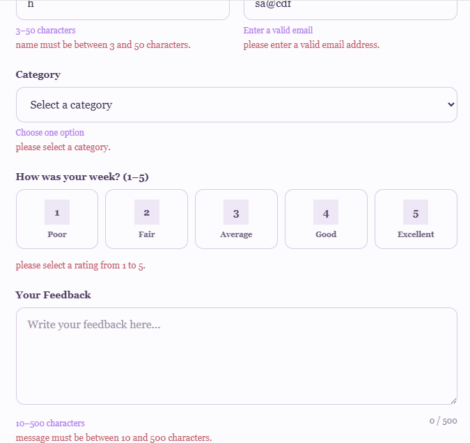
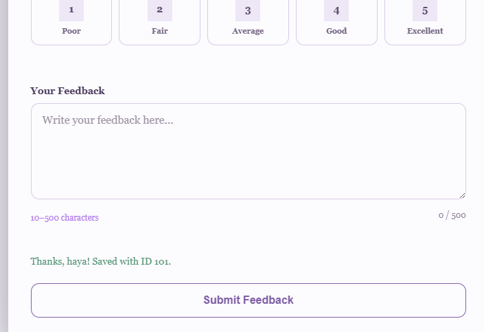

# Intern Feedback Form

A responsive intern feedback form built with plain HTML, CSS, and JavaScript. The form allows interns to submit their feedback by entering their name, email, category, rating, and message.

The form validates the user's input on the client side and sends the valid data to a mock REST API using a POST request. It also displays loading, success, and error states to clearly inform the user about what is happening.

## Live Demo

Try the live feedback form here:

https://intern-feedback-form-nine.vercel.app/

## Features

- Accessible HTML form with labels connected to their inputs
- Client-side validation with inline error messages
- Full name validation between 3 and 50 characters
- Email format validation
- Category selection
- Rating selection from 1 to 5
- Feedback message validation between 10 and 500 characters
- Character counter for the feedback message
- Sends form data to a mock REST API using the Fetch API
- Shows a loading message while the request is in progress
- Displays the returned record ID after a successful submission
- Resets the form after a successful submission
- Keeps the user's input if the request fails
- Responsive design for different screen sizes

## Technologies Used

- HTML5
- CSS3
- JavaScript
- Fetch API
- JSONPlaceholder

## API Used

This project uses JSONPlaceholder as a mock REST API.

The endpoint used is:

https://jsonplaceholder.typicode.com/posts

A POST request is sent with the following feedback data:

- name
- email
- category
- rating
- message

JSONPlaceholder was chosen because it requires no setup and is suitable for practicing how a frontend sends JSON data to a REST API. It returns a simulated successful response with an ID that is displayed to the user.

Because JSONPlaceholder is a fake API, the submitted data is not permanently stored like it would be in a real database.

## How to Run

1. Clone or download this repository.
2. Open the project folder in VS Code.
3. Open `index.html` in a web browser.

You can also use the Live Server extension in VS Code to run the project locally.

## Screenshots

### Validation Errors

This screenshot shows the inline validation messages displayed when the form is submitted with invalid or missing input.

### Successful Submission

This screenshot shows the success message displayed after the feedback is successfully submitted to the mock API.

## What I Learned

Through this project, I learned how to create and validate an HTML form using JavaScript. I learned how to use the Fetch API to send JSON data to a REST API using a POST request. I also learned how to handle asynchronous states such as loading, success, and error. The most challenging part was understanding how the frontend communicates with an API and how to handle failed requests while keeping the user's input available for retrying.
